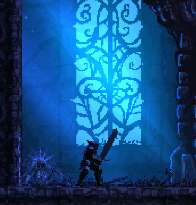

  
</head>
<body>

  

    <h1>Hi, I'm Khalfaoui Driss 👋</h1>
    
    

      
      
    

    
I'm passionate about technology, programming, and always eager to learn something new. Welcome to my GitHub profile!

  

  <!--
**KhalfaouiDriss/KhalfaouiDriss** is a ✨ _special_ ✨ repository because its `README.md` (this file) appears on your GitHub profile.

Here are some ideas to get you started:

- 🔭 I’m currently working on ...
- 🌱 I’m currently learning ...
- 👯 I’m looking to collaborate on ...

- 🤔 I’m looking for help with ...
- 💬 Ask me about ...
- 📫 How to reach me: ...
- 😄 Pronouns: ...
- ⚡ Fun fact: ...
-->
